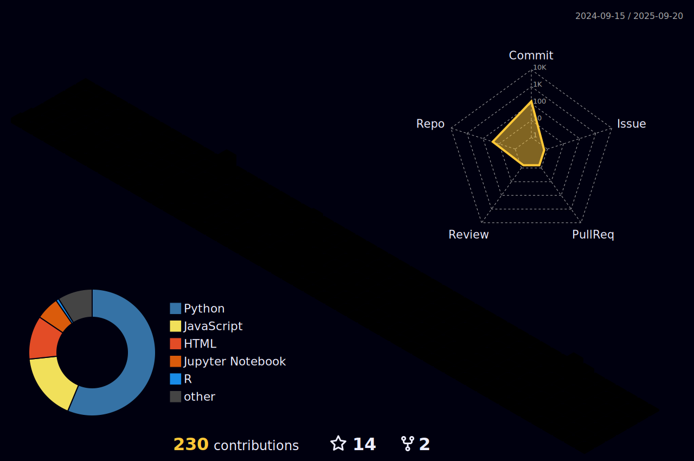

 <!--  -->
<!--  -->

<!-- <h3 align="center"> -->
	
<!--  --> 
<h1 align="center">
    
	
  

</h1>

<h2 align="center">⚒️ Languages-Frameworks-Tools ⚒️</h2><h3 align="center">

 <h3>
	 
  

</h3> 

---

</h1>

<h2 align="center">⭐ Quote ⭐</h2><h3 align="center">

 <h3>
	 

</h3> 

---

<h2 align="center">⚡ Stats ⚡</h2>
 

<!--  -->

</h3>

---
<h2 align="center">🐍 My Contributions 🐍</h2><h3 align="center">
<picture>
  <source
    media="(prefers-color-scheme: dark)"
    srcset="https://tinyurl.com/MeowwMeoww101"
  />
  <source
    media="(prefers-color-scheme: light)"
    srcset="https://tinyurl.com/PinkMeowwMeoww"
  />
  
</picture>

	

	Copyright &copy; 2023-present   <a href="https://github.com/SaadARazzaq" target="_blank">Saad Abdur Razzaq</a>

	

	 
  

